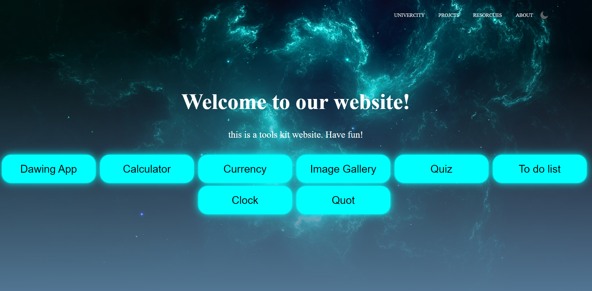
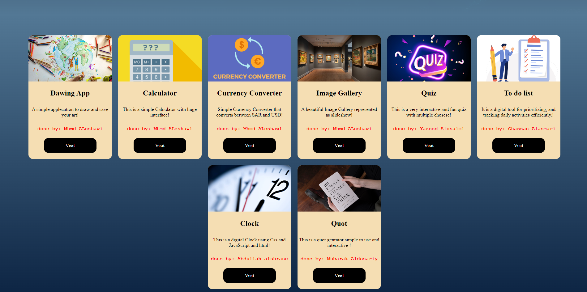

# JavaScript Essentials Project

## Overview
This repository contains two versions of a project created as part of a team assignment during college, focusing on JavaScript essentials. The first version was built using a combination of online tutorials and resources, while the second version was created without external help, based solely on our understanding of JavaScript concepts learned in class.

## Project Structure

### Version 1
The first version (`version-1`) of the project demonstrates the use of various JavaScript functionalities, enhanced with the help of multiple tutorials. This version includes several mini-projects, such as:
- **Calculator**: A simple calculator built using JavaScript.
- **Clock**: A real-time clock displaying the current time.
- **Currency Converter**: A tool for converting between currencies.
- **Drawing App**: A basic canvas-based drawing application.
- **Image Gallery**: An interactive image gallery with navigation controls.
- **Quiz**: A multiple-choice quiz implemented using JavaScript.
- **Quote Generator**: A random quote generator.
- **To-Do List**: A basic to-do list manager.

The directory also contains various images and resources used in the website's interface, along with the main HTML, CSS, and JavaScript files.

### Version 2
The second version (`version-2`) represents a simplified approach, where each team member focused on implementing specific functionalities without relying on external tutorials. The individual contributions include:
- **Abdulellah.html**
- **Ghassan.html**
- **INDEX.html** (Main entry point)
- **Mohammed.html**
- **Mubarek.html**
- **Yazed.html**

This version also includes a report (`Report.docx`), which summarizes the project work, challenges faced, and key learning outcomes.

## Directory Breakdown
 ```brach
.
├── version-1/
│   ├── MoreInfo/
│   │   └── index.html
│   ├── Projects/
│   │   ├── Calculator/
│   │   │   ├── index.html
│   │   │   ├── script.js
│   │   │   └── style.css
│   │   ├── Clock/
│   │   ├── Currency_Converter/
│   │   ├── Drawing_app/
│   │   ├── Image_Gallery/
│   │   ├── Quiz/
│   │   ├── Quot/
│   │   └── To_Do_List/
│   ├── img1.jpg
│   ├── img2.jpg
│   ├── index.html
│   ├── main.css
│   └── main.js
├── version-2/
│   ├── Abdulellah.html
│   ├── Ghassan.html
│   ├── INDEX.html
│   ├── Mohammed.html
│   ├── Mubarek.html
│   ├── Report.docx
│   └── yazed.html
```

## How to Run

1. **Version 1**:
   - Open the `index.html` file in the `version-1` directory to view the main page.
   - Explore the mini-projects by navigating through the links available on the main page.

2. **Version 2**:
   - Open the `INDEX.html` file in the `version-2` directory to view the simplified version of the project.
   - Each team member's work can be accessed through their respective HTML files.

## Team Members
- Abdulellah
- Ghassan
- Mohammed
- Mubarek
- Yazed

Each member contributed by implementing specific parts of the project, and the final product is a reflection of our combined understanding of JavaScript essentials.

## Screenshots

Screenshots for both versions of the project:





## Report
A detailed project report is available in `version-2/Report.docx`. This report outlines the purpose of the project, the challenges we faced, and the learning experience throughout the process.
